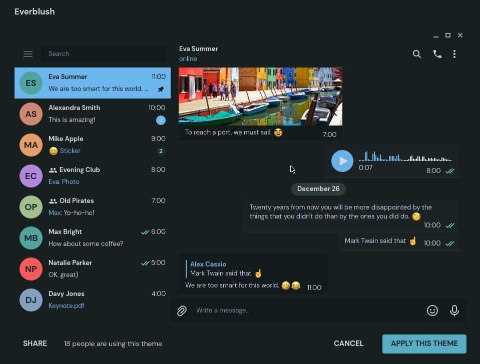

<h2 align="center"> Everblush Telegram </h2> 

 

 

## Preview 

## Installation 
- https://t.me/addtheme/Everblush
- Open telegram and navigate to Settings >> Chat Settings >> Create New Theme >> Import Existing Theme >> and select the everblush-tdesktop.theme file. 

